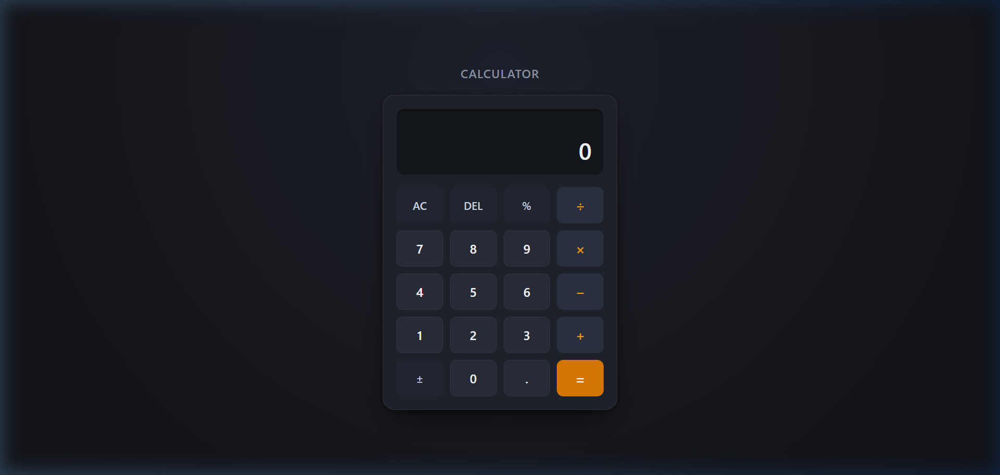

# Modern Minimalist Calculator

A clean, responsive, and tactile web calculator application built with semantic **HTML5**, **CSS3**, and **vanilla JavaScript**. Designed with a focus on usability, clean visual hierarchy, and precise arithmetic.



## Features

- **Clean & Practical UI**: Tactile dark slate interface inspired by modern desktop productivity tools (no neon AI gimmicks, bloated glassmorphism, or excessive gradients).
- **Dual-Line Display**: Secondary tracker shows full calculation expression (`25 + 15 =`) alongside the high-contrast main result display (`40`).
- **Precision Arithmetic**: Built-in floating-point normalization (eliminates common IEEE-754 issues such as `0.1 + 0.2 = 0.30000000000000004`).
- **Full Keyboard Support**: Seamlessly control all calculator operations using physical keyboard keys with active visual keypress feedback.
- **Consecutive & Chained Calculations**: Supports continuous expressions (e.g. `5 + 5 + 5 = 15`) and switching operators on the fly.
- **Robust Error Handling**: Graceful messaging for division by zero (`Cannot divide by 0`) and automatic error state clearance on subsequent input.
- **Accessible & Responsive**: Fully responsive layout tailored for mobile, tablet, laptop, and desktop viewports with `:focus-visible` accessibility indicators.
- **Zero Dependencies**: Pure vanilla JavaScript without external libraries, frameworks, or `eval()`.

## Keyboard Shortcuts

| Key | Action |
| --- | --- |
| `0` – `9` | Input numbers |
| `.` | Input decimal point |
| `+` | Addition |
| `-` | Subtraction |
| `*` | Multiplication |
| `/` | Division |
| `Enter` or `=` | Calculate result |
| `Backspace` | Delete last digit (DEL) |
| `Esc` or `C` | Clear everything (AC) |
| `%` | Convert to percentage |

## Technologies Used

- **HTML5**: Semantic tags, accessible ARIA attributes (`aria-live`, `aria-label`).
- **CSS3**: CSS custom properties, CSS Grid, Flexbox, responsive media queries, and smooth micro-transitions.
- **Vanilla JavaScript (ES6+)**: Event delegation, modular state management, and numerical string parsing.

## Project Structure

```text
CodeAlpha_Calculator/
│
├── index.html       # Application markup and structure
├── style.css        # Clean design system, themes, and layout
├── script.js       # Calculator logic, keyboard bindings, and precision math
└── README.md        # Documentation and deployment instructions
```

## How to Run Locally

Because this project is built entirely with vanilla web technologies, you do not need Node.js or any build tools:

1. **Clone or download** this repository:
   ```bash
   git clone https://github.com/your-username/CodeAlpha_Calculator.git
   ```
2. **Navigate** into the project folder:
   ```bash
   cd CodeAlpha_Calculator
   ```
3. **Open `index.html`** in any modern web browser:
   - Double-click `index.html` in your file explorer, OR
   - Run a local static server if preferred:
     ```bash
     npx serve .
     # or with Python
     python -m http.server 8000
     ```

## How to Deploy to GitHub Pages

You can publish this calculator online for free in under 2 minutes:

1. Push your code to a GitHub repository.
2. In your repository on GitHub, click **Settings** (top menu bar).
3. In the left sidebar, click **Pages** (under the "Code and automation" section).
4. Under **Build and deployment**:
   - Source: Select **Deploy from a branch**.
   - Branch: Select **main** (or `master`) and directory `/ (root)`.
5. Click **Save**.
6. Wait 1–2 minutes, and GitHub will provide your live URL (e.g. `https://<your-username>.github.io/CodeAlpha_Calculator/`).

## License

This project is open source and available under the [MIT License](LICENSE).
